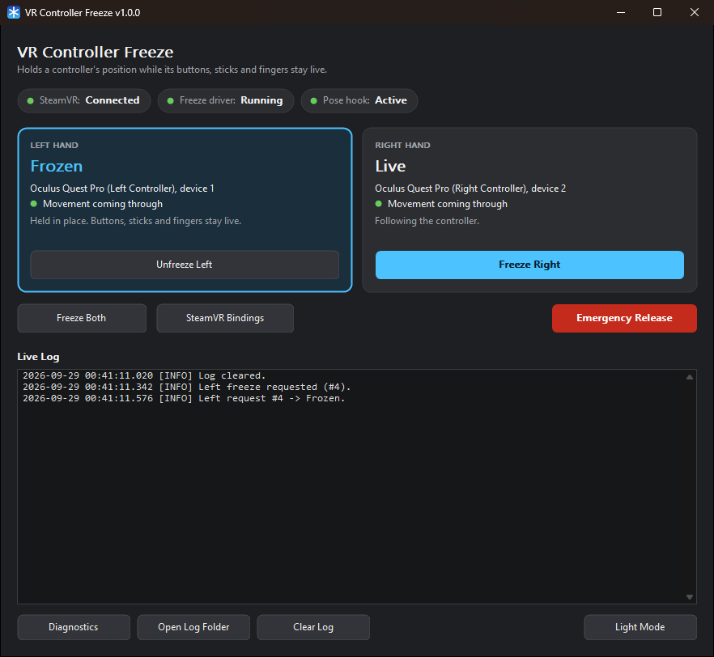

<p align="center">
  
</p>

<h1 align="center">VR Controller Freeze</h1>

<p align="center">Freeze a VR controller's position in SteamVR: the in-game hand stays put while you move the real controller, and its buttons, sticks, triggers, finger tracking and vibration keep working.</p>

<p align="center">
  
</p>

Made for VRChat on a Meta Quest Pro connected to SteamVR through **Steam Link**. Freeze a hand and the avatar's hand stays exactly where it was, however you move the real controller. Unfreeze it and the hand follows the controller again.

## Features

- **Freeze position, keep everything else**: a frozen hand keeps reporting its last position with no movement, while buttons, sticks, triggers, capacitive touch, skeletal finger input and haptics stay fully native
- **A card for each hand**: its state, its controller, whether movement is coming through, and its own Freeze / Unfreeze button
- **Status pills** for SteamVR, the freeze driver and the pose hook, so you can see at a glance that freezing is available
- **Emergency Release** unfreezes both hands at once, and the Live Log confirms it
- **Press and hold a thumbstick** to freeze or unfreeze that hand without taking off the headset; a normal click is left to the game, and the button can be changed in SteamVR Bindings
- Clear warnings when a frozen hand moves to another device (for example hand tracking) or its controller is put down or asleep, and a stated reason for every freeze that is refused
- Fail-safe driver: lets go of both hands within three seconds if the app closes, crashes or stops responding (see [Safety](#safety))
- Works alongside other pose hooks such as Space Calibrator and SmoothTracking
- Dark mode by default, with a Light Mode switch the app remembers; DPI-aware, resizable window with full keyboard navigation
- Live Log in the window and on disk, plus a one-click diagnostics collector for bug reports

## How it works

A small SteamVR driver sits between Steam Link and SteamVR. When you freeze a hand, it keeps reporting that controller's last position, with no movement, instead of its live position. Nothing else about the controller changes, so games see your real controller with a hand that is not moving. The desktop app is where you freeze and unfreeze hands and see what is happening.

## Requirements

- Windows 10 or 11 (64-bit).
- SteamVR, with the headset connected through Steam Link. Other connection methods may work; the Live Log tells you whether freezing is available (see [Troubleshooting](#troubleshooting)).

## Download

Download `VRControllerFreeze-<version>-win-x64.zip` from the [latest release](https://github.com/SweetSamanthaVR/VRControllerFreeze/releases/latest). GitHub builds and tests it from the source in this repository.

1. Right-click the zip, choose **Properties**, tick **Unblock** and click **OK**. This stops Windows warning about every file inside it.
2. Extract it to a folder you will keep, for example `C:\VR`. SteamVR loads the driver from this folder, so do not leave it in Downloads; if you ever move it, run `install-driver.cmd` again.
3. Close SteamVR completely, then run `install-driver.cmd` in the extracted `VRControllerFreeze` folder.

The installer backs up your SteamVR settings first and undoes everything if any step fails.

The app and driver are not code-signed. If Windows shows "Windows protected your PC" when you first start `VRControllerFreeze.exe`, click **More info**, then **Run anyway**. Some antivirus tools may also flag `driver_vrcontrollerfreeze.dll`, because it hooks into SteamVR's controller position updates. That is how freezing works, not a sign that anything is wrong; the full source is in this repository.

**Updating:** close SteamVR, extract the new version, and run its `install-driver.cmd`. It replaces the old version's registration, so there is nothing to uninstall first.

## Build from source

Only needed if you want to build VR Controller Freeze yourself. It needs [Visual Studio 2026](https://visualstudio.microsoft.com/) with the "Desktop development with C++" workload (the free Community edition is fine), and an internet connection for the first build.

1. Run `build.cmd`.
2. Close SteamVR completely.
3. Run `install-driver.cmd`.

Keep the project folder where it is: SteamVR loads the driver from inside it.

## Use

1. Connect the Quest through Steam Link so SteamVR is running.
2. Start `VRControllerFreeze.exe`, in the folder you extracted (or in `build\dist` if you built it yourself).
3. Check the status pills at the top: SteamVR **Connected**, freeze driver **Running** and pose hook **Active**, each with a green dot. Each hand's card shows its controller and a green dot for "Movement coming through".
4. Click **Freeze Left** or **Freeze Right** in a hand's card. The card turns blue and says **Frozen**; click **Unfreeze** to let go.

From the headset, **press a thumbstick in and hold it** to freeze that hand; do the same again to unfreeze it. The controller buzzes once for a freeze and twice for an unfreeze. A normal click of the thumbstick still goes to the game.

Amber means something needs your attention and red means something went wrong; the card or the Live Log says what. A hand's freeze button is grey while it cannot freeze, and clicking it logs the reason.

A freeze holds one device. If SteamVR moves a hand to a different device (for example when the Quest switches from controllers to hand tracking), the freeze stops affecting that hand. The hand's card turns amber with **Not in effect**, and the Live Log explains; unfreeze and freeze again.

## Controls

| Control | Action |
|---|---|
| **Freeze Left** / **Freeze Right** | Freeze that hand where it is; click again (**Unfreeze**) to let go |
| **Freeze Both** / **Unfreeze Both** | Freeze or unfreeze both hands together |
| Press a thumbstick in and hold it | Freeze or unfreeze that hand from the headset (default) |
| **Emergency Release** | Unfreeze both hands at once, confirmed in the Live Log |
| **SteamVR Bindings** | Open SteamVR's bindings editor to change the thumbstick button |
| **Diagnostics** | Show the driver, pose hook and per-hand details |
| **Open Log Folder** | Open the folder holding the saved log |
| **Clear Log** | Empty the Live Log and the saved log file |
| **Light Mode** / **Dark Mode** | Switch the window theme (remembered) |

## Troubleshooting

The Live Log explains what is happening. Common messages:

| Live Log says | What to do |
|---|---|
| SteamVR is not running | Start SteamVR; the app connects on its own. |
| SteamVR freeze driver is not running | Close SteamVR, run `install-driver.cmd`, and start SteamVR again. |
| Driver pose hook: FAILED | Collect diagnostics (below) and report it; freezing cannot work until this is fixed. |
| Driver is not seeing pose updates | Wake the controller. If it persists, the controller's tracking driver bypasses the hook and cannot be frozen. |
| Rejected: no recent tracked pose | The controller is asleep or not tracking. Move it and try again. |
| Rejected: no controller holds this hand role | Turn the controller on, or check SteamVR can see it. |
| Not in effect (amber card) | The controller is put down or asleep, or the hand is now a different device (for example hand tracking). The freeze applies again when the controller returns; otherwise unfreeze and freeze again. |
| Emergency release not confirmed | Close the app: the driver lets go of both hands within three seconds. Then collect diagnostics. |
| SteamVR could not identify this app | Custom bindings may not apply; the desktop buttons still work. |

To report a problem, run `collect-diagnostics.cmd` and include the file it creates. Your Windows user name and computer name are replaced with `<user>` and `<computer>`, so the file is safe to post publicly.

## Safety

- If the app closes, crashes or stops responding, the driver lets go of both hands within three seconds.
- If a frozen controller disconnects, SteamVR is told so, rather than being shown a frozen position.
- If SteamVR restarts, nothing is frozen again automatically.
- The driver does nothing until the app has been started. After the app closes, it passes every position through unchanged.

## Logs

The Live Log is shown in the window and saved to `%LOCALAPPDATA%\VRControllerFreeze\logs\VRControllerFreeze.log`, rolling over to `VRControllerFreeze.previous.log` at 5 MB. **Open Log Folder** opens it.

## Uninstall

Close SteamVR, then run `uninstall-driver.cmd`. It removes the driver and its SteamVR settings (backing the settings up first), and the app's saved preferences.

## Development

The app and the driver talk through shared memory:

```
src/app/      VRControllerFreeze.exe: window, hand logic, SteamVR connection, Live Log
src/driver/   SteamVR driver DLL: pose hook and freeze request handling
src/common/   shared-memory contract used by both the app and the driver
tests/        static checks, app logic unit tests and a driver harness
tools/        build, install, uninstall and diagnostics scripts
```

`build.cmd -Test` builds everything and runs every test, including a harness that loads the real driver into a fake SteamVR host. GitHub Actions runs the same on each push, and attaches the tested download to each release. Build options, code signing and the release checklist are in [docs/DEVELOPMENT.md](docs/DEVELOPMENT.md), and how the driver and app work together is in [docs/ARCHITECTURE.md](docs/ARCHITECTURE.md).

## Licence

Made by SweetSamanthaVR and released under the [MIT Licence](LICENSE).

Third-party licences (OpenVR and MinHook) are listed in [THIRD_PARTY.md](THIRD_PARTY.md).
